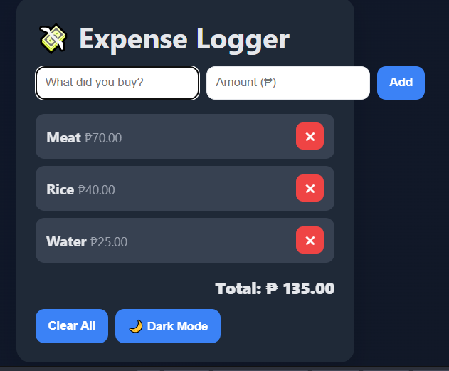

📌 Overview
The Simple Expense Logger is a lightweight web app that helps you track your daily expenses quickly and efficiently.
It allows you to add expense descriptions, enter amounts, view the total spent, and manage your list by deleting specific items or clearing everything at once.
Dark mode support ensures a comfortable experience for both day and night usage.

🛠 Features

Add Expense — Enter a description and amount, then log it with one click.

Delete Expense — Remove a specific entry from the list.

Clear All — Wipe all expenses instantly (with confirmation).

Total Calculation — Automatically updates the total amount spent.

Dark Mode Toggle — Switch between light and dark themes.

Persistent Storage — Saves data in localStorage so entries remain after refreshing or closing the browser.

💻 Tech Stack

HTML – Page structure and layout.

CSS – Styling and theme customization.

JavaScript – Functional logic, DOM manipulation, and local storage management.

## 📷 Screenshot

